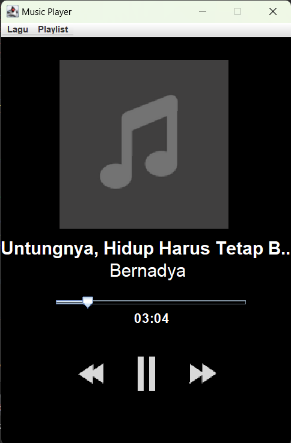

<!--Nama Proyek-->
<h1>Aplikasi Pemutar Musik MP3</h1>

<!--Pendahuluan-->
<h2>Pendahuluan</h2>

Aplikasi Pemutar Musik MP3 adalah proyek yang bertujuan untuk mengembangkan sebuah aplikasi desktop berbasis Java yang mampu memutar file MP3 dengan berbagai fitur tambahan. Proyek ini dirancang untuk memberikan pengalaman mendengarkan musik yang nyaman, sekaligus memberikan pengembang wawasan tentang cara kerja pemrosesan audio menggunakan Java. 
Aplikasi ini dibangun dengan memanfaatkan beberapa pustaka Java populer yang mendukung manipulasi file audio, pengelolaan metadata, dan fitur antarmuka pengguna.

<!--Teknologi/Framework-->
<h2>Teknologi dan Framework</h2>
<ul>
  <li><b>JDK 18+ - Versi Java</b></li>
  <li><b>Mp3Magic</b> - Perpustakaan Java untuk membaca file MP3 dan memanipulasi tag ID3 pada file MP3</li>
  <li><b>JLayer</b> - Perpustakaan untuk mendekode, memutar, atau mengonversi file MP3 pada platform Java™</li>
  <li><b>JAudioTagger</b> - Perpustakaan Java untuk mengedit informasi tag pada file audio, mendukung aplikasi Java dalam mengelola file digital</li>
</ul>

<!--Fitur-->
<h2>Fitur</h2>
<ul>
  <li>Memutar file MP3</li>
  <li>Menampilkan judul lagu</li>
  <li>Menampilkan nama artis</li>
  <li>Menampilkan durasi lagu</li>
  <li>Fungsi putar ulang</li>
  <li>Menjeda lagu</li>
  <li>Melanjutkan lagu</li>
  <li>Berpindah ke lagu berikutnya dalam daftar putar</li>
  <li>Berpindah ke lagu sebelumnya dalam daftar putar</li>
  <li>Membuat daftar putar khusus</li>
  <li>Memuat daftar putar khusus</li>
</ul>

<!--Tangkapan Layar-->
<h2>Tangkapan Layar</h2>

  

